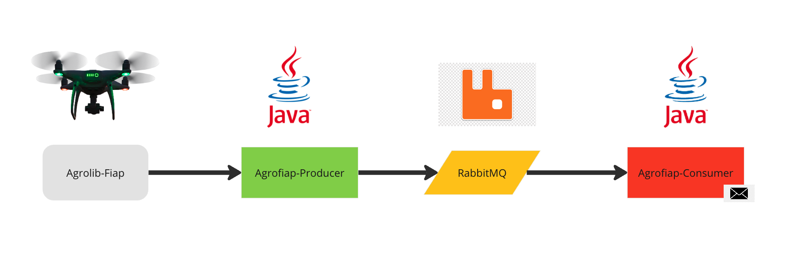

# agro-fiap
Trabalho feito na matéria de INTEGRATIONS &amp; DEVELOPMENT TOOLS da turma 43scj MBA em Fullstack development

## Desafio
O desafio proposto é desenvolver uma solução para o agronegócio, com coleta de dados via sensores de temperatura e umidade. Esses sensores ficarão instalados em um drone com uma altíssima economia pois conta com pequenos, porém muito eficientes, painéis fotovoltaicos. 
A cada 10 segundos são enviados para message broker os dados de temperatura e umidade capturado naquele instante.

1.	A cada 10 segundos é feito uma leitura dos dados (temperatura e umidade) e os dados enviados para um serviço de mensagens.
2.	O microsserviço deve enviar um alerta (pode ser um email) quando em 1 minuto:
a.	Temperatura (>= 35 ou <=0) ou (Umidade <= 15%).
b.	Envie no corpo do e-mail o id_drone e os valores capturados.

## Solução
Para o desafio de criar uma solução para o agronegócio, foi proposta uma solução baseada em mensageria, utilizando o Java, Spring e o Rabbit MQ, conforme apresentado no quadro abaixo: 

- DRONE: Dispositivo capaz de realizar leituras do ambiente o qual esta inserido e envia-las para a aplicação AGROFIAP-PRODUCER.
- AGROLIB-FIAP: Biblioteca em java contendo classes utilizadas pelas aplicações AGROFIAP-PRODUCER e AGROFIAP-CONSUMER.
- AGROFIAP-PRODUCER: Interface disponibilizada ao drone para envio dos dados referentes às leituras que são encaminhadas para a fila do RABBIT MQ.
- RABBIT MQ: Servidor de mensageria.
- AGROFIAP-CONSUMER: Aplicação responsável por processar as leituras dos drones e envio de emails alertas conforme necessário

## Tecnologias utilizas
- Java
- Spring
- Docker
- RabbitMQ

## Como rodar o projeto
1. Realizar o git Clone do projeto
2. Baixar as depêndencias do Maven
3. Rodar o comando "docker compose up -d" no arquivo docker compose para subir a imagem do RabbitMQ
4. Rodar o projeto Agrofiap-producer
5. Realizar o login do Rabbit MQ no endereço http://localhost:15672/#/
6. Configurar o e-mail de envio no properties do projeto Agrofiap-consumer
7. Rodar o projeto Agrofiap-consumer
8. Utilizar os endpoints http://localhost:8080/leitura e http://localhost:8080/drone para envio de informações

