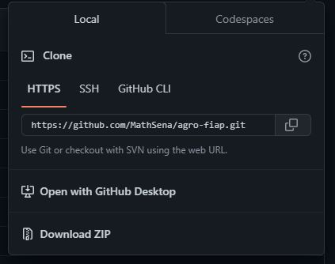
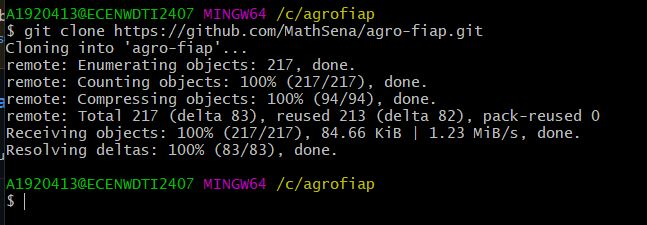
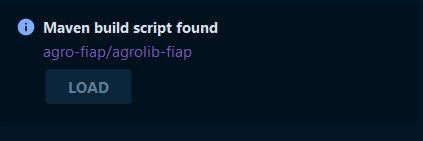
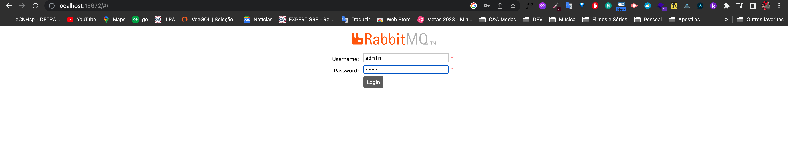
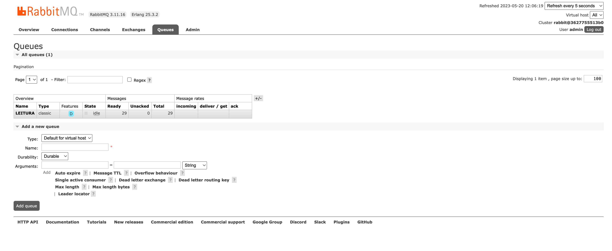
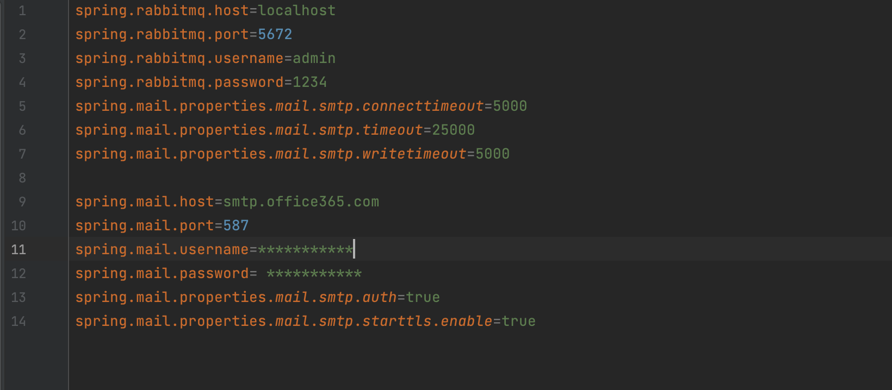
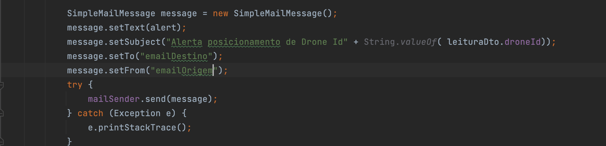
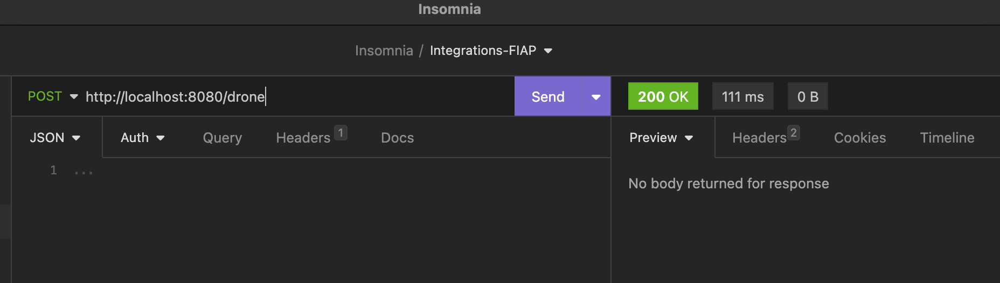
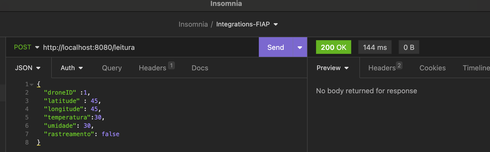
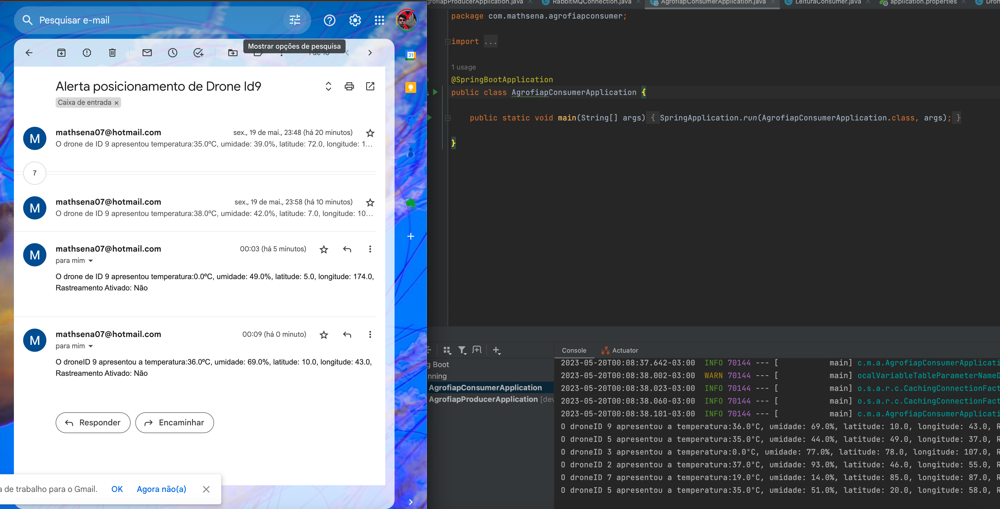

# agro-fiap
Trabalho feito na matéria de INTEGRATIONS &amp; DEVELOPMENT TOOLS da turma 43SCJ do MBA em Fullstack development

## Desafio
O desafio proposto é desenvolver uma solução para o agronegócio, com coleta de dados via sensores de temperatura e umidade. Esses sensores ficarão instalados em um drone com uma altíssima economia pois conta com pequenos, porém muito eficientes, painéis fotovoltaicos. 
A cada 10 segundos são enviados para message broker os dados de temperatura e umidade capturado naquele instante.

1.	A cada 10 segundos é feito uma leitura dos dados (temperatura e umidade) e os dados enviados para um serviço de mensagens.
2.	O microsserviço deve enviar um alerta (pode ser um email) quando em 1 minuto:
a.	Temperatura (>= 35 ou <=0) ou (Umidade <= 15%).
b.	Envie no corpo do e-mail o id_drone e os valores capturados.

## Solução
Este projeto é uma aplicação de exemplo que ilustra como utilizar o RabbitMQ como um sistema de mensageria para processar pedidos de forma assíncrona. A aplicação consiste em três componentes principais: o produtor (AGROFIAP-PRODUCER), o consumidor (AGROFIAP-PRODUCER) e o RabbitMQ como intermediário entre eles.

O produtor responsável por receber os dados de localização do drone e publicá-los em uma fila no RabbitMQ. O consumidor  é um serviço que consome os pedidos da fila do RabbitMQ e realiza o processamento necessário para envio de e-mail. 
A utilização do RabbitMQ permite que o produtor e o consumidor operem de forma independente, garantindo a escalabilidade e a resiliência do sistema.
Para o desafio de criar uma solução para o agronegócio, foi proposta uma solução baseada em mensageria, utilizando o Java, Spring e o Rabbit MQ, conforme apresentado no quadro abaixo: 

- DRONE: Dispositivo capaz de realizar leituras do ambiente o qual esta inserido e envia-las para a aplicação AGROFIAP-PRODUCER.
- AGROLIB-FIAP: Biblioteca em java contendo classes utilizadas pelas aplicações AGROFIAP-PRODUCER e AGROFIAP-CONSUMER.
- AGROFIAP-PRODUCER: Interface disponibilizada ao drone para envio dos dados referentes às leituras que são encaminhadas para a fila do RABBIT MQ.
- RABBIT MQ: Servidor de mensageria.
- AGROFIAP-CONSUMER: Aplicação responsável por processar as leituras dos drones e envio de emails alertas conforme necessário.

## Tecnologias utilizas
- Java
- Spring
- Docker
- RabbitMQ

## Como rodar o projeto
1. Realizar o git Clone do projeto

2. Baixar as depêndencias do Maven

Obs.: Caso haja problemas em relaçao a AGROLIB-FIAP, será necessário adicionar a LIB conforme exemplo abaixo (caso for utilizar o InteliJ)
1. Clicar no botão +

2. Adicionar a Lib e confirmar para que fique visivel para o produtor e consumidor do projeto

3. Rodar o comando "docker compose up -d" no arquivo docker compose para subir a imagem do RabbitMQ

4. Rodar o projeto Agrofiap-producer

5. Realizar o login do Rabbit MQ no endereço http://localhost:15672/#/

6. Configurar o e-mail de envio no properties do projeto Agrofiap-consumer

7. Rodar o projeto Agrofiap-consumer
8. Utilizar os endpoints http://localhost:8080/leitura e http://localhost:8080/drone para envio de informações

## Resultados
### Envio de e-mail com dados de localização do Drone

## Sobre o RabbitMQ
O RabbitMQ é um sistema de mensageria de código aberto amplamente utilizado na construção de arquiteturas de software distribuídas. 
Ele oferece uma solução para transmitir e receber mensagens entre diferentes componentes de um sistema, permitindo a comunicação assíncrona e o desacoplamento entre aplicativos, serviços e sistemas.

### Pontos-chave sobre o uso do RabbitMQ:

- Comunicação assíncrona: O RabbitMQ é projetado para permitir a comunicação assíncrona entre os componentes de um sistema distribuído. Isso significa que os remetentes de mensagens (produtores) e os destinatários de mensagens (consumidores) não precisam estar ativos simultaneamente. As mensagens são armazenadas em filas até que sejam consumidas pelos destinatários.

- Padrão de troca de mensagens: O RabbitMQ implementa o padrão de troca de mensagens, onde os produtores publicam mensagens em filas e os consumidores as consomem. Isso permite que diferentes componentes se comuniquem de maneira flexível e independente, reduzindo o acoplamento entre eles.

- Filas: O RabbitMQ armazena as mensagens em filas, que são estruturas de armazenamento temporário. As filas são responsáveis por receber, armazenar e distribuir as mensagens aos consumidores. Elas podem ser configuradas com diferentes políticas de gerenciamento de filas, como exclusão automática, prioridades e tempo de vida das mensagens.

- Roteamento de mensagens: O RabbitMQ permite o roteamento de mensagens com base em critérios específicos. Ele fornece diferentes tipos de trocas (exchanges), como troca direta, tópico e fanout, que direcionam as mensagens para as filas correspondentes com base em regras de roteamento definidas.

- Garantia de entrega: O RabbitMQ oferece garantia de entrega de mensagens. Ele pode confirmar a recepção da mensagem pelo consumidor, garantindo que ela seja processada com sucesso. Além disso, é possível configurar confirmações de envio (publisher confirms) para garantir que as mensagens publicadas pelo produtor sejam entregues à troca com sucesso.

- Escalabilidade e alta disponibilidade: O RabbitMQ foi projetado para ser escalável e resiliente. Ele suporta a criação de clusters, onde vários nós RabbitMQ podem ser configurados para trabalhar juntos, distribuindo as filas e as mensagens entre eles. Essa arquitetura permite que o sistema lide com grandes volumes de mensagens e garanta alta disponibilidade.

- Integração com várias linguagens e tecnologias: O RabbitMQ é compatível com várias linguagens de programação e oferece bibliotecas de cliente para facilitar a integração em diferentes ecossistemas. Você pode usar o RabbitMQ com linguagens como Python, Java, C#, JavaScript e muitas outras.

- Casos de uso: O RabbitMQ é amplamente utilizado em diversas aplicações, como sistemas de enfileiramento de pedidos, processamento de eventos em tempo real, gerenciamento de filas de tarefas assíncronas, integração de microsserviços e muito mais. Sua flexibilidade e recursos tornam-no uma escolha

projeto desenvolvido por Matheus Sena
